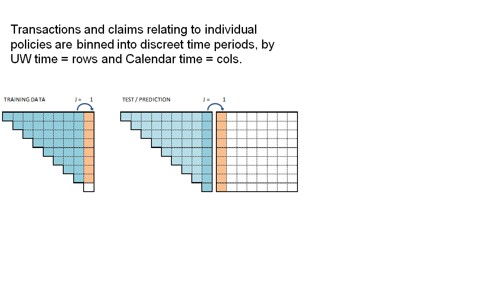

# R: Bauldry ML Reserving Pt 2
# Introduction

This is the second notebook of a series of three that outlines and elaborates upon code used to replicate the central scenario in the paper of Maximilien Baudry "NON-PARAMETRIC INDIVIDUAL
CLAIM RESERVING IN INSURANCE"

[https://www.institutdesactuaires.com/global/gene/link.php?doc_id=11747&fg=1](https://www.institutdesactuaires.com/global/gene/link.php?doc_id=11747&fg=1)  
[http://chaire-dami.fr/files/2016/10/Reserving-article.pdf](http://chaire-dami.fr/files/2016/10/Reserving-article.pdf)

In this notebook we step through the process to create the underlying data structures that will be used in the machine learning reserving process, as set out in sections 2 and 3 of Baudry's paper. 

The reserving data structures built in this notebook are from a simulated phone insurance dataset. The creation of that simulated dataset has been set out in detail in the first R Notebook of this series. The third Notebook outlines the process for creating reserves using machine learning.

# A few words before we start

Baudry assumes that a policy follows a [Position Dependent Marked Poisson Process](https://www.cambridge.org/core/services/aop-cambridge-core/content/view/7DA57FED4B4CFE953E7DA31B29844967/S0515036100003317a.pdf/claims_reserving_in_continuous_time_a_nonparametric_bayesian_approach.pdf) for which he uses the following graphical representation. 


Baudry explains the notation and database build in sections 2 and 3 of his paper. It is worth taking the time to familiarise yourself with this way of presenting reserving data as it is a different perspective on the traditional claim triangle. 

When I first tried to code this paper I had to re-read the approach to building the reserving database many times. Even then the overall process of getting the code to work took weeks and many iterations before it came together for me. So from personal experience I'd say it may take time to understand and follow the details of the approach.  Hopefully this series of notebooks will help speed up that process of familiarisation and having made the investment of time exhibits such as the one below will become intuitive.


The data requirements for this approach to reserving are more akin to those used in Pricing. Policy underwriting features are directly used in the reserving process requiring policy and claim records to be joined at the policy exposure period level of granularity. In fact I'd say the data requirements are equivalent to a pricing dataset with two added levels of complexity. 

The first additional complexity is that the history of claim transactions are not aggregated over dimensions of time as they would be in Pricing. The second level of complexity is that by keeping those time dimensions we can include additional data sources in the analysis that would not normally be relevant to Pricing annual policies.  

So, for example, explicit use of:  

* weather information can be included by joining on the claim occurrence time dimension which, you could imagine, would improve IBNR forecasting;  
*  claim settlement features such as claim handler hours worked or claims system downtime can be included by joining on claim processing date. This, you could imagine, would help explain internal variation in claim payment patterns.  

The table below summarises the reserve models Baudry builds and the classes of explanatory data features each model uses. 


|Feature|Description|RBNS|IBNR Frequency|IBNR Severity|
|:--|:---------|:-:|:-:|:-:|
|$T_{0,p}$| Underwriting features and policy underwriting date|Y|Y|Y|
|$t_i - T_{0,p}$| Policy exposure from underwriting date $T_0$ to valuation date $t_i$| Y |Y|Y|
|$F_{t_{i,p}}$| Policy risk features at valuation date $t_i$|Y|Y|Y|
|$E_{T_{0,p}}$| External information at policy underwriting date $T_0$ |Y|Y|Y|
|$E_{T_{1,p}}$| External information at claim occurrence $T_1$|Y|N|N|
|$E_{T_{2,p}}$| External information at claim reporting date $T_2$|Y|N|N|
|$I_{t_{i,p}}$| Internal claim related information up to valuation date $t_i$|Y|N|N|


Baudry shows how this extra data can benefit the reserving process and recognises that it is the adoption of machine learning techniques that enable us to work with larger and more granular volumes of data than we are able to with  traditional chain ladder reserving techniques.


```{r include=FALSE}
# Importing packages

library(knitr)
library(rmdformats)
library(data.table)
library(magrittr)
library(lubridate)
library(ggplot2)
library(cowplot)
library(repr)
library(kableExtra)
library(IRdisplay)
```


```{r include=FALSE}
simulate_central_scenario <- function(seed = 1234){
  
  #seed = 1234  
  set.seed(seed)
  
  # Policy data
  #~~~~~~~~~~~~~~~~~
  
  # polices sold between start 2016 to end 2017
  dt_policydates <- data.table(date_UW = seq(as.Date("2016/1/1"), as.Date("2017/12/31"), "day"))
  
  # number of policies per day follows Poisson process with mean 700 (approx 255,500 pols per annum)
  dt_policydates[, ':='(policycount = rpois(.N,700),
                        date_lapse = date_UW %m+% years(1),
                        expodays = as.integer(date_UW %m+% years(1) - date_UW),
                        pol_prefix = year(date_UW)*10000 + month(date_UW)*100 + mday(date_UW))]
  
  
  # Add columns defining Policy Covers   
  dt_policydates[, Cover_B := round(policycount * 0.25)]
  dt_policydates[, Cover_BO := round(policycount * 0.45)]
  dt_policydates[, Cover_BOT := policycount - Cover_B - Cover_BO]
  
  
  # repeat rows for each policy by UW-Date
  dt_policy <- dt_policydates[rep(1:.N, policycount),c("date_UW", "pol_prefix"), with = FALSE][,pol_seq:=1:.N, by=pol_prefix]
  
  # Create a unique policy number 
  dt_policy[, pol_number := as.character(pol_prefix * 10000 + pol_seq)]
  
  # set join keys
  setkey(dt_policy,'date_UW')
  setkey(dt_policydates,'date_UW')  
  
  # remove pol_prefix before join
  dt_policydates[, pol_prefix := NULL]  
  
  # join cover from summary file (dt_policydates)
  dt_policy <- dt_policy[dt_policydates]  
  
  # now create Cover field for each policy row
  dt_policy[,Cover := 'BO']
  dt_policy[pol_seq <= policycount- Cover_BO,Cover := 'BOT']
  dt_policy[pol_seq <= Cover_B,Cover := 'B']  
  
  # remove interim calculation fields
  dt_policy[, ':='(pol_prefix = NULL,
                   policycount = NULL,
                   pol_seq = NULL,
                   Cover_B = NULL,
                   Cover_BOT = NULL,
                   Cover_BO = NULL)]
  
  # Add remaining policy details
  dt_policy[, Brand := rep(rep(c(1,2,3,4), c(9,6,3,2)), length.out = .N)]
  dt_policy[, Base_Price := rep(rep(c(600,550,300,150), c(9,6,3,2)), length.out = .N)]
  
  # models types and model cost multipliers
  for (eachBrand in unique(dt_policy$Brand)) {
    dt_policy[Brand == eachBrand, Model := rep(rep(c(3,2,1,0), c(10, 7, 2, 1)), length.out = .N)]
    dt_policy[Brand == eachBrand, Model_mult := rep(rep(c(1.15^3, 1.15^2, 1.15^1, 1.15^0), c(10, 7, 2, 1)), length.out = .N)]
  }
  
  dt_policy[, Price := ceiling (Base_Price * Model_mult)]
  
  
  # colums to keep
  cols_policy <- c("pol_number",
                   "date_UW",
                   "date_lapse",
                   "Cover",
                   "Brand",
                   "Model",
                   "Price")
  
  dt_policy <- dt_policy[, cols_policy, with = FALSE]
  
  # check output
  #head(dt_policy)
  
  #save(dt_policy, file = "./dt_policy.rda")
  
  
  # Claims data
  #~~~~~~~~~~~~~~~~~
  
 # All policies have breakage cover
  # claims uniformly sampled from policies
  claim <- sample(nrow(dt_policy), size = floor(nrow(dt_policy) * 0.15))
  
  # Claim serverity multiplier sampled from beta distn
  dt_claim <- data.table(pol_number = dt_policy[claim, pol_number],
                         claim_type = 'B',
                         claim_count = 1,
                         claim_sev = rbeta(length(claim), 2,5))
  
  # identify all policies with Oxidation cover
  cov <- which(dt_policy$Cover != 'B')
  
  # sample claims from policies with cover
  claim <- sample(cov, size = floor(length(cov) * 0.05))
  
  # add claims to table 
  dt_claim <- rbind(dt_claim,
                    data.table(pol_number = dt_policy[claim, pol_number],
                               claim_type = 'O',
                               claim_count = 1,
                               claim_sev = rbeta(length(claim), 5,3)))
  
  
  # identify all policies with Theft cover
  # for Theft claim frequency varies by Brand
  # So need to consider each in turn...
  
  for(myModel in 0:3) {
    
    cov <- which(dt_policy$Cover == 'BOT' & dt_policy$Model == myModel)
    claim <- sample(cov, size = floor(length(cov) * 0.05*(1 + myModel)))
    
    dt_claim <- rbind(dt_claim,
                      data.table(pol_number = dt_policy[claim, pol_number],
                                 claim_type = 'T',
                                 claim_count = 1,
                                 claim_sev = rbeta(length(claim), 5,.5)))
  }
  
  # set join keys
  setkey(dt_policy, pol_number)
  setkey(dt_claim, pol_number)
  
  #join Brand and Price from policy to claim
  dt_claim[dt_policy,
           on = 'pol_number',
           ':='(date_UW = i.date_UW,
                Price = i.Price,
                Brand = i.Brand)]
  
  # use lubridate %m+% date addition operator 
  dt_claim[, date_lapse := date_UW %m+% years(1)]
  dt_claim[, expodays := as.integer(date_lapse - date_UW)]
  dt_claim[, occ_delay_days := floor(expodays * runif(.N, 0,1))]
  
  dt_claim[ ,delay_report := floor(365 * rbeta(.N, .4, 10))]  
  dt_claim[ ,delay_pay := floor(10 + 40* rbeta(.N, 7,7))]  
  
  dt_claim[, date_occur := date_UW %m+% days(occ_delay_days)]
  dt_claim[, date_report := date_occur %m+% days(delay_report)]
  dt_claim[, date_pay := date_report %m+% days(delay_pay)]
  
  dt_claim[, claim_cost := round(Price * claim_sev)]
  
  dt_claim[, clm_prefix := year(date_report)*10000 + month(date_report)*100 + mday(date_report)]
  
  dt_claim[, clm_seq := seq_len(.N), by = clm_prefix]
  dt_claim[, clm_number := as.character(clm_prefix * 10000 + clm_seq)]
  
  # keep only first claim against policy (competing hazards)
  setkeyv(dt_claim, c("pol_number", "clm_prefix"))
  dt_claim[, polclm_seq := seq_len(.N), by = .(pol_number)]
  dt_claim <- dt_claim[polclm_seq == 1,]
  

  # colums to keep
  cols_claim <- c("clm_number",
                  "pol_number",
                  "claim_type",
                  "claim_count",
                  "claim_sev",
                  "date_occur",
                  "date_report",
                  "date_pay",
                  "claim_cost")
  
  dt_claim <- dt_claim[, cols_claim, with = FALSE]
  
  output <- list()
  output$dt_policy <- dt_policy
  output$dt_claim <- dt_claim
  
  return(output)

}
```

# Simulate policy and claim data

We start with the simulated phone insurance policy and claim dataset. I am calling the function from Notebook 1 of this series to create the dataset. Using a fixed seed will ensure you get a reproducible simulated dataset.

```{r}
dt_PhoneData <- simulate_central_scenario(1234)
```

We can now inspect the returned Policy dataset and similarly inspect the returned Claim dataset. 

Both have been created to be somewhat similar to standard policy and claim datasets that insurers would extract from their policy and claim administration systems.

## Policy 

```{r echo=FALSE}
dt_policy <- dt_PhoneData$dt_policy

kable(head(dt_policy), "html") %>% 
  kable_styling("striped") %>% 
  scroll_box(width = "100%") %>%
  as.character() %>%
  display_html()
```

## Claim 


```{r echo=FALSE}

dt_claim <- dt_PhoneData$dt_claim

kable(head(dt_claim), "html") %>% 
  kable_styling(c("striped", "hover", "condensed")) %>% 
  scroll_box(width = "100%") %>%
  as.character() %>%
  display_html()
```


# Join policy and claim data

We wish to join claims to the appropriate policy exposure period. This will be a familiar process to pricing actuaries but may not be familiar to reserving actuaries as it is not a requirement in traditional chain ladder reserving. 

For speed and convenience we will use the `foverlaps` R function, which needs the tables being joined to have common keys for policy number and time periods.


```{r}

setnames(dt_policy, c('date_UW', 'date_lapse'), c('date_pol_start', 'date_pol_end'))
  
# set policy start and end dates in foverlap friendly format
dt_policy[, date_pol_start:= floor_date(date_pol_start, unit= "second")]
dt_policy[, date_pol_end:= floor_date(date_pol_end, unit= "second") - 1]
  
# create a dummy end claim occurrence date for foverlap
dt_claim[, date_occur:= floor_date(date_occur, unit= "second")]
dt_claim[, date_occur_end:= date_occur]
dt_claim[, date_report:= floor_date(date_report, unit= "second")]
dt_claim[, date_pay:= floor_date(date_pay, unit= "second")]
  
# set keys for claim join (by policy and dates)
setkey(dt_claim, pol_number, date_occur, date_occur_end)
setkey(dt_policy, pol_number, date_pol_start, date_pol_end)
  
# use foverlaps to attach claim to right occurrence period and policy
dt_polclaim <- foverlaps(dt_policy, dt_claim, type="any") ## return overlap indices
dt_polclaim[, date_occur_end := NULL]
```

The first few rows of the resulting table are shown below where we can see the first policy has an attached claim.

```{r}
head(dt_polclaim)
```

## Check for multi-claim policies

In a real world situation it is possible for policies to have multiple claims in an insurance period. In such circumstances care needs to be taken in matching policy exposure periods and claims, typically this is done by splitting a policy into sequences that stop at the date of each claim. 

Our simulated data does not have this complication, as this check shows, the max number or sequences is 1.

```{r}

setkey(dt_polclaim, pol_number, date_pol_start)
  
# create 2 new cols that count how many claims against each policy
dt_polclaim[,
            ':='(pol_seq = seq_len(.N),
                 pol_seq_max = .N),
            by = c('pol_number', 'date_pol_start') ]
  
table(dt_polclaim[, pol_seq_max])
  
```

Not all policies have claims, resulting in NA fields in the joined dataset. To facilitate future processing we need to deal with NA fields in the joined policy and claims dataset. Missing dates are set to a long dated future point. Where there are no claims, we set claim counts and costs to zero, resulting in the following table.


```{r}

#set NA dates to 31/12/2999
lst_datefields <- grep(names(dt_polclaim),pattern = "date", value = TRUE)
  
for (datefield in lst_datefields)
  set(dt_polclaim,which(is.na(dt_polclaim[[datefield]])),datefield,as_datetime("2199-12-31 23:59:59 UTC"))
 
#set other NAs to zero (claim counts and costs)
for (field in c("claim_count", "claim_sev", "claim_cost"))
  set(dt_polclaim,which(is.na(dt_polclaim[[field]])),field,0)

```

```{r include=FALSE}
#Clean up ----
dt_polclaim[, ExpoDays:= ceiling((as.numeric(date_pol_end) - as.numeric(date_pol_start))/(24*60*60*365))]
dt_polclaim <- dt_polclaim[ExpoDays > 0]
  
rm(dt_claim)
rm(dt_policy)
  
gc()

```

```{r echo=FALSE}
head(dt_polclaim)
```

# Timeslicing claim payments

Although this paper works with individual policy and claim transactions those transactions are collated into time slices. 

Baudry selected time slices of 30 days in length starting from 01 Jan 2016 (Section 5 page 13). 


In the code below, for every individual policy and claim transaction; ie row in `dt_polclaim`, we are creating an extra column for each possible timeslice and recording in the column the cumulative claim cost up to that time slice. 

Given that in the simple simulated dataset we only have one claim payment for any claim, the code to do this is rather more simple than would otherwise be the case. The code below would need to be amended if there are partial claim payments.  

This time sliced dataset becomes the source of our RBNS and IBNER datasets used in subsequent machine learning steps.


```{r}

lst_Date_slice <- floor_date(seq(as.Date("2016/1/1"), as.Date("2019/06/30"), by = 30), unit= "second") 

# Time slice Policy & claims 
 
for (i in 1:length(lst_Date_slice)){
  dt_polclaim[date_pay<= lst_Date_slice[i], paste0('P_t_', format(lst_Date_slice[i], "%Y%m%d")):= claim_cost]
  set(dt_polclaim,which(is.na(dt_polclaim[[paste0('P_t_', format(lst_Date_slice[i], "%Y%m%d"))]])),paste0('P_t_', format(lst_Date_slice[i], "%Y%m%d")),0)
}
  
# sort data by policynumber
setkey(dt_polclaim, pol_number)

```

Looking at the data can see the output of timeslicing. You'll need to scroll to the right of the table to see the columns labeled **P_t_20160101** through to **P_t_20190614**.


```{r echo=FALSE}
head(dt_polclaim)
```

# Creating RBNS and IBNER datasets

Before we create the RBNS and IBNER datasets we must pick a valuation point from the available timeslices. I'm selecting the 10th point for illustration, which is the 10th 30 day period from 01/01/2016, ie a valuation date of 27/09/2016.

```{r}
#_ 2.1 Set initial variables ----
#~~~~~~~~~~~~~~~~~~~~~~~
    
i <- valuation <- 10
t_i <- lst_Date_slice[i] 
delta <- min(i, length(lst_Date_slice) - i + 1)
```

In a traditional approach we would be creating reserving triangles with 10, 30 day duration development periods. 

As we will see the approach adopted by Baudry, in section 3 of his paper, is somewhat different and is much closer to the sort of datasets that Pricing Actuaries are familiar with. 


## Creating RBNS dataset

We start with the RBNS dataset.

The training data for the for the RBNS reserves will consist of all claims reported prior to the valuation date. This data has been joined to the policy exposure data to enable policy related features to be used as explanatory variables in the RBNS reserve calculation. 

A training dataset will enable us to build a model of RBNS reserve requirements at historic valuation dates. But what we really require is a view of the RBNS reserve at the valuation date. To calculate this we need to create a test dataset that contains values of the explanatory features at each future claim payment period. 

By making model prediction for each row of the test dataset we can calculate the RBNS reserve as the sum of predicted future payments. 

## RBNS dataset functions {.tabset}

To create the RBNS train and test datasets we have provided two functions `RBNS_Train_ijk` and `RBNS_Test_ijk` which take as an input the joined policy and claims dataset and return data in a format suitable for applying machine learning.

They are actually returning the 'triangle' data for all occurrence periods, **i**, for a specified: 

* claim development delay, **j**; and
* model type **k**

For values of **k** equal to 1 claim transactions up to the valuation date are included. When **k** is set to 2 transactions in the calendar period immediately prior to the valuation date are excluded. Although in this example only models with a **k** value of 1 are created, Baudry's framework allows for multiple **k** value models to be built. In doing so multiple models are created, effectively using aged data which would allow an ensemble modeling approach to be used. Such use of multiple **k** values would be similar to a Bornhuetter-Ferguson approach to modeling. 


### RBNS_Train

The code for creating the RBNS datasets is rather involved so detailed explanation has been skipped over here.  
Interested readers are encouraged to come back to this stage and inspect the code and Baudry’s paper once they have an overview of the wider process.

I should call out that the code shared here deals only with the simplified payment process from Baudry's central scenario, ie claims are settled with a single payment. Real world data with partial payments would require material changes to be made to the code we have shared. Such changes are left for interested readers to make.

I'll also flag here, and expand in notebook 3, that the "settled with a single payment assumption" prevents claim payment information from being used as an explanatory feature in the subsequent machine learning process of notebook 3. 


```{r echo=TRUE}
RBNS_Train_ijk <- function(dt_policy_claim, date_i, j_dev_period, k, reserving_dates, model_vars) {
  
  # # debugging
  # #~~~~~~~~~~~~~
  # dt_policy_claim = dt_polclaim
  # date_i = t_i
  # j_dev_period = 1
  # k = 1
  # reserving_dates = lst_Date_slice
  # #~~~~~~~~~~~~~
  #   
  
  date_i <- as.Date(date_i)
  date_k <- (reserving_dates[which(reserving_dates == date_i) - k + 1])
  date_j <- (reserving_dates[which(reserving_dates == date_k) - j_dev_period])
  
  #i - j - k + 1 (predictor as at date)
  date_lookup <- (reserving_dates[which(reserving_dates == (date_i)) - j_dev_period -k + 1]) 
  
  #i - k to calculate target incremental paid
  target_lookup <- (reserving_dates[which(reserving_dates == (date_i)) - k]) 
  
  #i -k + 1 to calculate target incremental paid
  target_lookup_next <- (reserving_dates[which(reserving_dates == (date_i)) - k + 1]) 
  
  #definition of reported but not settled
  dt_policy_claim <- dt_policy_claim[(date_report <= date_lookup) & (date_pay > date_lookup)] 
  
  #simulated data assumes one payment so just need to check date paid in target calc
  dt_policy_claim[, ':='(date_lookup = date_lookup,
                         delay_train = as.numeric(date_lookup - date_pol_start), #extra feature
                         j = j_dev_period,
                         k = k,
                         target = ifelse(date_pay<=target_lookup,0,ifelse(date_pay<=target_lookup_next,claim_cost,0)))]
  
  return(dt_policy_claim[, model_vars, with = FALSE])
}

```
### RBNS_Test

The code for creating the RBNS datasets is rather involved so detailed explanation has been skipped over here.  
Interested readers are encouraged to come back to this stage and inspect the code and Baudry’s paper once they have an overview of the wider process.

I should call out that the code shared here deals only with the simplified payment process from Baudry's central scenario, ie claims are settled with a single payment. Real world data with partial payments would require material changes to be made to the code we have shared. Such changes are left for interested readers to make.

I'll also flag here, and expand in notebook 3, that the "settled with a single payment assumption" prevents claim payment information from being used as an explanatory feature in the subsequent machine learning process of notebook 3. 

```{r echo=TRUE}
RBNS_Test_ijk <- function(dt_policy_claim, date_i,j_dev_period, k, reserving_dates, model_vars) {
  
  # # debugging
  # #~~~~~~~~~~~~~
  # dt_policy_claim = dt_polclaim
  # date_i = t_i
  # j_dev_period = 1
  # k = 1
  # reserving_dates = lst_Date_slice
  # #~~~~~~~~~~~~~
  #   
  date_i <- as.Date(date_i)
  
  #i - j - k + 1 (predictor as at date)
  date_lookup <- (reserving_dates[which(reserving_dates == (date_i))]) 
  
  #i - k to calculate target incremental paid
  target_lookup <- (reserving_dates[which(reserving_dates == (date_i)) +j_dev_period - 1]) 
  
  #i -k + 1 to calculate target incremental paid  
  target_lookup_next <- (reserving_dates[which(reserving_dates == (date_i)) + j_dev_period]) 
  
  #definition of reported but not settled
  # P_te_RBNS rowids of policies needing an RBNS reserve
  dt_policy_claim <- dt_policy_claim[date_report <= date_lookup & date_lookup < date_pay] 
  
  #model assumes one payment so just need to check date paid
  dt_policy_claim[, ':='(date_lookup = date_lookup,
                         delay_train = as.numeric(date_lookup - date_pol_start), #extra feature
                         j = j_dev_period,
                         k = k,
                         target = ifelse(date_pay<=target_lookup,0,ifelse(date_pay<=target_lookup_next,claim_cost,0)))] 
  
return(dt_policy_claim[, model_vars, with = FALSE])
  
}

```

## RBNS function calls

The RBNS train and test datasets are created by calling the `RBNS_Train` and `RBNS_Test` functions passing, as parameters to them, the names of the joined policy and claim dataset, valuation dates and model features. 

The functions  `RBNS_Train` and `RBNS_Test` iterate over valid values of j and k calling the `RBNS_Train_ijk` and `RBNS_Test_ijk` functions to create the complete train and test datasets as illustrated below. 


```{r}
RBNS_Train <- function(dt_policy_claim, date_i, i, k, reserving_dates, model_vars) {
# Create a combined TRAIN dataset across all k and j combos
  for (k in 1:k){
    if (k==1) dt_train <- NULL
    for (j in 1:(i - k + 1)){
      dt_train <- rbind(dt_train, RBNS_Train_ijk(dt_polclaim, date_i, j, k,reserving_dates, model_vars))
    }
  }  
  return(dt_train)
}
```


```{r}

RBNS_Test <- function(dt_policy_claim, date_i, delta, k, reserving_dates, model_vars) {
  
  # Create a combined TEST dataset across all k and j combos
  for (k in 1:k){
    if (k==1) dt_test <- NULL
    for (j in 1:(delta - k + 1)){
      dt_test <- rbind(dt_test, RBNS_Test_ijk(dt_polclaim, date_i, j, k,reserving_dates, model_vars))
    }
  }
  
  return(dt_test)
}


```

The animation below attempts to summarise the overall data preparation and model prediction process. 





So having given a rough outline of the data creation process let's now call the functions to create the RBNS datasets.

```{r}

#define modelVars
RBNS_model_vars <- c("clm_number",
                     "pol_number",
                     "j",
                     "k",
                     "date_pol_start",
                     "date_occur",
                     "date_report",
                     "date_pay",
                     "Cover",
                     "claim_type",
                     "Brand",
                     "Model",
                     "Price",
                     "target"
    )


# Create a combined TRAIN dataset for k = 1 and all valid j delay values
dt_RBNS_train <- RBNS_Train(dt_polclaim, t_i, i, k = 1, lst_Date_slice, RBNS_model_vars)

# Create a combined TEST dataset for k = 1 and all valid j delay values
dt_RBNS_test <- RBNS_Test(dt_polclaim, t_i, delta, k = 1, lst_Date_slice, RBNS_model_vars)

```

The train and test datasets are then joined into a single dataset and a small amount of tidying is done to make them ready for use.

```{r}

# Add a flag to determine which rows are from the trainset and which from the test set
dt_RBNS_train[, flgTrain := 1]
dt_RBNS_test[, flgTrain := 0]

# combine into a single RBNS dataset   
dt_All_RBNS <- rbind(dt_RBNS_train, dt_RBNS_test)
#write.csv(dt_All_RBNS,"dt_All_RBNS.csv", row.names = F)
    


```

```{undefined include=FALSE, language="undefined"}
# tidy up
rm(dt_RBNS_train)
rm(dt_RBNS_test)
gc()
    
```

The important aspects of the tidying relate to creating useable delay metrics from the numerous dates and converting some character features such as cover and claim type into factors.

```{r}

# order and create some delay fields
setkey(dt_All_RBNS, clm_number, k, j)
    
dt_All_RBNS[, Count := .N , by =clm_number]

#create date and delay measure by converting from source seconds since 01/01/1970 to day periods

dt_All_RBNS[, ':='(
  delay_uw_occ = ifelse(year(date_occur) == 2199,
                        -1,
                        ceiling((as.numeric(date_occur) - as.numeric(date_pol_start)) / (24 * 60 * 60))
                        ),
  delay_occ_rep = ifelse(year(date_occur) == 2199,
                         -1,
                         ceiling((as.numeric(date_report) - as.numeric(date_occur)) / (24 * 60 * 60))
                         ),
  
  delay_uw_val = ceiling((as.numeric(t_i) - as.numeric(date_pol_start)) / (24 * 60 * 60)),
  delay_rep_pay = ceiling((as.numeric(date_pay) - as.numeric(date_report)) / (24 * 60 * 60)),
  date_uw = ceiling(as.numeric(date_pol_start) / (24 *  60 * 60)),
  
  Cover = as.factor(Cover),
  claim_type = as.factor(claim_type)
  )]
  

```

## Creating IBNR dataset

The IBNR dataset creation follows a similar process to RBNS but is a little more complex. Any policy with a live exposure can give rise to an IBNR claim so the training dataset consists of all policy exposure periods prior to the valuation date. 

From this we train two models:

* a frequency model to predict if there will be an IBNR claim; and
* a severity model to predict the expected cost of any IBNR claim

This is very similar to the traditional pricing approach except that we can add information relating to the claim occurrence date (eg weather information could be useful for Storm losses) and we also predict the incremental run-off of the exposure period.  

## IBNR dataset functions {.tabset}

### IBNR_Frequency Train
The code for creating the IBNR datasets is rather involved so detailed explanation has been skipped over here.  
Interested readers are encouraged to come back to this stage and inspect the code and Baudry’s paper once they have an overview of the wider process.

```{r}


IBNR_Freq_Train_ijk <- function(dt_policy_claim, date_i, j_dev_period, k, reserving_dates, model_vars, verbose = FALSE) {
  
  # # debugging
  # #~~~~~~~~~~~~~
  # dt_policy_claim = dt_polclaim
  # date_i = t_i
  # j_dev_period = 1
  # k = 1
  # reserving_dates = lst_Date_slice
  # model_vars <- IBNR_model_vars
  # #~~~~~~~~~~~~~
  
  date_i <- as.Date(date_i)
  date_k <- (reserving_dates[which(reserving_dates == date_i) - k + 1])
  date_j <- (reserving_dates[which(reserving_dates == date_k) - j_dev_period])
  date_lookup <- (reserving_dates[which(reserving_dates == (date_i)) - j_dev_period -k + 1]) #i - j - k + 1 (predictor as at date)
  target_lookup <- (reserving_dates[which(reserving_dates == (date_i)) - k]) #i - k to calculate target incremental paid
  target_lookup_next <- (reserving_dates[which(reserving_dates == (date_i)) - k + 1]) #i -k + 1 to calculate targte incremental paid
  
  if(verbose) cat(paste("Valn date", date_i, ", j = ", j_dev_period, ", k =", k, "\n"))
  
  dt_policy_claim <- dt_policy_claim[date_pol_start < date_lookup  & date_lookup < date_report] #definition of IBNR
  
  dt_policy_claim[, ':='(date_lookup = date_lookup,
                         delay_train = as.numeric(date_lookup - date_pol_start), #extra feature
                         j = j_dev_period,
                         k = k,
                         exposure = round((pmin(as.numeric(as.numeric(date_pol_end)), as.numeric(floor_date(date_i, unit= "second")))
                                             - as.numeric(date_pol_start))/(24*60*60*365), 3),
                         target = ifelse(target_lookup <= date_pay &  date_pay< target_lookup_next & date_occur <= date_lookup ,1,0))]
  
  dt_policy_claim <- dt_policy_claim [,.(exposure = sum(exposure)), by= c(setdiff(model_vars, 'exposure')) ]
  
  return(dt_policy_claim[, model_vars, with = FALSE])
  
}

```


### IBNR_Loss Train
The code for creating the IBNR datasets is rather involved so detailed explanation has been skipped over here.  
Interested readers are encouraged to come back to this stage and inspect the code and Baudry’s paper once they have an overview of the wider process.

```{r}

IBNR_Loss_Train_ijk <- function(dt_policy_claim, date_i, j_dev_period, k, reserving_dates, model_vars, verbose = FALSE) {
  
  
  # # debugging
  # #~~~~~~~~~~~~~
  # dt_policy_claim = dt_polclaim
  # date_i = t_i
  # j_dev_period = 1
  # k = 1
  # reserving_dates = lst_Date_slice
  # model_vars <- IBNR_model_vars
  # #~~~~~~~~~~~~~
  
  date_i <- as.Date(date_i)
  date_k <- (reserving_dates[which(reserving_dates == date_i) - k + 1])
  date_j <- (reserving_dates[which(reserving_dates == date_k) - j_dev_period])
  date_lookup <- (reserving_dates[which(reserving_dates == (date_i)) - j_dev_period -k + 1]) #i - j - k + 1 (predictor as at date)
  target_lookup <- (reserving_dates[which(reserving_dates == (date_i)) - k]) #i - k to calculate target incremental paid
  target_lookup_next <- (reserving_dates[which(reserving_dates == (date_i)) - k + 1]) #i -k + 1 to calculate targte incremental paid
  
  if(verbose) cat(paste("Valn date", date_i, ", j = ", j_dev_period, ", k =", k, "\n"))
  
  dt_policy_claim <- dt_policy_claim[(date_lookup < date_report) & (date_occur < date_lookup) & (target_lookup >= date_pay  & date_pay < target_lookup_next)] #definition of reported but not settled
  dt_policy_claim[, ':='(date_lookup = date_lookup,
                         delay_train = as.numeric(date_lookup - date_pol_start), #extra feature
                         j = j_dev_period,
                         k = k,
                         exposure = 1, #all claims trated equal
                         
                         target = ifelse(target_lookup >= date_pay & date_pay < target_lookup_next,claim_cost,0) #model assumes one payment so just need to check date paid
                         
  )]
  
  return(dt_policy_claim[, model_vars, with = FALSE])
}

```


### IBNR Test
The code for creating the IBNR datasets is rather involved so detailed explanation has been skipped over here.  
Interested readers are encouraged to come back to this stage and inspect the code and Baudry’s paper once they have an overview of the wider process.


```{r}

IBNR_Test_ijk <- function(dt_policy_claim, date_i,j_dev_period, k, reserving_dates, model_vars, verbose = FALSE) {
  
  ## debugging
  ##~~~~~~~~~~~~~
  #dt_policy_claim = dt_polclaim
  #date_i = t_i
  #j_dev_period = 8
  #k = 1
  #reserving_dates = lst_Date_slice
  #model_vars <- IBNR_model_vars
  ##~~~~~~~~~~~~~
  
  date_i <- as.Date(date_i)
  date_lookup <- (reserving_dates[which(reserving_dates == (date_i))]) #i - j - k + 1 (predictor as at date)
  target_lookup <- (reserving_dates[which(reserving_dates == (date_i)) +j_dev_period - 1]) #i - k to calculate target incremental paid
  target_lookup_next <- (reserving_dates[which(reserving_dates == (date_i)) + j_dev_period]) #i -k + 1 to calculate targte incremental paid  
  
  if(verbose) cat(paste("Valn date", date_i, ", j = ", j_dev_period, ", k =", k, "\n"))
  
  # P_te_IBNR rowids of policies needing an RBNS reserve
  dt_policy_claim <- dt_policy_claim[date_pol_start <= date_lookup & date_lookup < date_report] #IBNR
  
  dt_policy_claim[, ':='(date_lookup = date_lookup,
                         delay_train = as.numeric(date_lookup - date_pol_start), #extra feature
                         j = j_dev_period,
                         k = k,
                         exposure = round((pmin(as.numeric(as.numeric(date_pol_end)), as.numeric(floor_date(date_i, unit= "second")))
                                             - as.numeric(date_pol_start))/(24*60*60*365),3),
                         target = ifelse(target_lookup <= date_pay &  date_pay < target_lookup_next & date_occur <= date_lookup ,claim_cost,0))]  #model assumes one payment so just need to check date paid
  
  dt_policy_claim <- dt_policy_claim [,.(exposure = sum(exposure)), by= c(setdiff(model_vars, 'exposure')) ]
  
  return(dt_policy_claim[, model_vars, with = FALSE])
  
}


```


## IBNR function calls 

The IBNR train and test datasets are created by calling the `IBNR_Train` and `IBNR_Test` functions passing, as parameters to them, the names of the joined policy and claim dataset, valuation dates and model features. 

The functions  `IBNR_Train` and `IBNR_Test` iterate over valid values of j and k calling the `IBNR_Freq_ijk`, `IBNR_Loss_ijk` and `IBNR_Test_ijk` functions to create the complete train and test datasets as set out in the code below. 

The princple and code is similar to that of RBNS, except that the training data covers both claim counts and costs.

```{r}

IBNR_Train <- function(dt_policy_claim, date_i, i, k, reserving_dates, model_vars, verbose = FALSE) {

  # Create a combined TRAIN dataset across all k and j combos
    for (k in 1:k){
      if (k==1){
        dt_train_Freq <- NULL
        dt_train_Loss <- NULL
      }
      
      for (j in 1:(i - k + 1)){
        dt_train_Freq <- rbind(dt_train_Freq, IBNR_Freq_Train_ijk(dt_policy_claim, date_i, j, k,reserving_dates, model_vars, verbose))
        dt_train_Loss <- rbind(dt_train_Loss, IBNR_Loss_Train_ijk(dt_policy_claim, date_i, j, k,reserving_dates, model_vars, verbose))
      }
    }

  return(list(Freq = dt_train_Freq, Loss = dt_train_Loss))
}

```


```{r}

IBNR_Test <- function(dt_policy_claim, date_i, delta, k, reserving_dates, model_vars, verbose = FALSE) {
 
  # Create a combined TEST dataset across all k and j combos
  for (k in 1:k){
    if (k==1) dt_test <- NULL
    for (j in 1:(delta - k + 1)){
      dt_test <- rbind(dt_test, IBNR_Test_ijk(dt_policy_claim, date_i, j, k,reserving_dates, model_vars, verbose))
    }
  }
  return(dt_test)
}

```

So having given a rough outline of the data creation process lets now call the functions to create the IBNR datasets.

```{r}
#define IBNR modelVars
IBNR_model_vars <- c("clm_number",
                     "pol_number",
                     "j",
                     "k",
                     "exposure",
                     "date_pol_start",
                     "date_occur",
                     "date_report",
                     "date_pay",
                     "Cover",
                     "Brand",
                     "Model",
                     "Price",
                     "target")
    
# Create a combined TRAIN dataset for k = 1 and all valid j delay values
lst_IBNR_train <- IBNR_Train(dt_polclaim, t_i, i, k = 1,lst_Date_slice, IBNR_model_vars)

# Create a combined TEST dataset for k = 1 and all valid j delay values
dt_IBNR_test <- IBNR_Test(dt_polclaim, t_i, delta, k = 1,lst_Date_slice, IBNR_model_vars)

```

The train and test datasets are then joined into a single dataset and a small amount of tidying is done to make them ready for use.

```{r}

lst_IBNR_train$Freq[, flgTrain := 1]
lst_IBNR_train$Loss[, flgTrain := 2]
dt_IBNR_test[, flgTrain := 0]

dt_All_IBNR <- rbind(lst_IBNR_train$dt_train_Freq, lst_IBNR_train$dt_train_Loss, dt_IBNR_test)
#write.csv(dt_All_IBNR,"dt_All_IBNR.csv", row.names = F)
```


```{r}
# tidy up
rm(lst_IBNR_train)
rm(dt_IBNR_test)
gc()
```

The important aspects of the tidying relate to creating useable delay metrics from the numerous dates and converting some character features such as cover and claim type into factors.

```{r}
# order and create some delay fields
setkey(dt_All_IBNR, clm_number, k, j)
    
dt_All_IBNR[, Count := .N , by =clm_number]
dt_All_IBNR[,':='( delay_uw_occ = ifelse(year(date_occur) == 2199,
                                        -1,
                                        ceiling((as.numeric(date_occur) - as.numeric(date_pol_start))
                                                  /(24*60*60))
                                          ),
                   delay_occ_rep = ifelse(year(date_occur) == 2199,
                                          -1,
                                          ceiling((as.numeric(date_report) - as.numeric(date_occur))
                                                  /(24*60*60))
                                          ),
                   delay_rep_pay = ifelse(year(date_occur) == 2199,
                                          -1,
                                          ceiling((as.numeric(date_pay) - as.numeric(date_report))
                                                  /(24*60*60))
                                          ),
                   delay_uw_val = ceiling((as.numeric(t_i) - as.numeric(date_pol_start))/(24*60*60)),
                   date_uw = ceiling(as.numeric(date_pol_start)/(24*60*60)),
                   Cover = as.factor(Cover))]
```

# Dataset inspection{.tabset}

So we now have two datasets;

 * dt_ALL_RBNS for calculating RBNS reserves  
 * dt_ALL_IBNR for calculating IBNR reserves  
 
Each dataset contains both training rows and test rows. The test rows are used for model prediction; which in this case means RBNS or IBNR reserve calculation. 

IBNR reserves are calculated using a frequency * severity model approach. IBNR therefore requires two models and two training datasets. Training rows for the claim frequency model are identified as rows with a flgTrain column value of 1. Training rows for the claim severity model are identified as rows with a flgTrain column value of 2.

In both datsets the test rows are identified as rows with a flgTrain column value of 0.

Let's have a quick look at the datasets. 

## RBNS

The RBNS dataset has `r ncol(dt_All_RBNS)` columns and `r format(nrow(dt_All_RBNS), big.mark=",")` rows.

In a traditional reserving exercise this would have been summarised as a 10 x 10 triangle ie 55 rows. We have far more rows of data for 3 main reasons;

1. training data is presented without aggregation so there is a row for each one of the `r format(dt_polclaim[date_report <= t_i, sum(claim_count)],big.mark=",")` claims that have been reported up until `r t_i`
2. the machine learning training dataset is not just the latest triangle of data as at the valuation date. It is also every possible historic triangle prior to the valuation date as illustrated in the animation above. 
3. the dataset also contains test rows ie the features needed to predict each future period from the current valuation date. 

```{r echo=FALSE}
head(dt_All_RBNS)
```

## IBNR  
  
The IBNR dataset has `r ncol(dt_All_IBNR)` columns and `r format(nrow(dt_All_IBNR), big.mark=",")` rows.

In a traditional reserving exercise this would have been summarised as a 10 x 10 triangle ie 50 rows. We have far more rows of data and far more that we did for the RBNS dataset.

Again the the same 3 principles apply to the IBNR row count. However this will lead to many more rows of data  because we are training two models and the  claim frequency model will require a row for every past policy exposure period and of course there should be orders of magnitude more exposure rows than claim rows!


```{r echo=FALSE}
head(dt_All_IBNR)
```

# Summary

I've deliberately rushed through the creation of the datasets so we can see the end output shown above. Interested readers are encouraged to revisit and review the RBNS and IBNER data creation process to gain a deeper understanding. In doing so they will be better placed to adapt the code provided to their own circumstances. 

To aid that deeper understanding, if you wish to try out this code in your own local instance of R then we have made this code and the supporting files and folders available in a zip file [here](/mlr-blog/l_baudry/Baudry_2.zip).

Download and extract the zip file to a local directory and then open the R project file `Baudry_2.rproj` in your local R software installation. In the root of the project folder you will see two files;  

1. Notebook_2_CreateReservingDatabase_v1.Rmd - which is the source code used to recreate this notebook
2. Notebook_2_CreateReservingDatabase_v1.R - the equivalent code provided as an R script

Please note that, depending upon your R installation , you may have to install R libraries before you can run the code provided. R will warn you if you have missing dependencies and you can then install them from CRAN.

The above code can be wrapped into a series of functions which, given a  joined policy and claim dataset and a valuation date, will return the reserving datasets needed for machine learning. In notebook 3 of this series we will create and use such functions prior to fitting a machine learning model to the training data and then use it to make reserve predictions.

```{r}

```
